<div align="center">



**🌐 Версии:** [English](README.md) · [Русский](README.ru.md) · [Сайт](https://bestdeejay-design.github.io/neo-consulting/)

# НЕО КОНСАЛТИНГ — лендинг бухгалтерского аутсорсинга

Статический лендинг для **ООО «НЕО КОНСАЛТИНГ»** — бухгалтерские, налоговые и
юридические услуги для ИП и ООО на УСН в Санкт-Петербурге.

Собран на чистом HTML/CSS/JS без сборщиков и **без внешних запросов** — все шрифты,
иконки, изображения и метаданные локальные.

## Статус проверок

| Проверка | Результат |
|---|---|
| Lighthouse mobile | **100 / 100 / 100 / 100** |
| Lighthouse desktop | **91 / 100 / 100 / 100** (порог 90) |
| meta_audit | 17/18 (одно ложное срабатывание описано в `.audit/meta-notes.md`) |
| Контраст WCAG AA | все пары текст/фон ≥ 4.5:1 |
| Raw hex вне дизайн-токенов | 0 |

## Живой сайт

[bestdeejay-design.github.io/neo-consulting](https://bestdeejay-design.github.io/neo-consulting/)

## Быстрый старт

```bash
# открыть напрямую
open index.html

# или локальный сервер
python3 -m http.server 8377
```

## Возможности

- **14 секций лендинга** (`hero`, `problems`, `solution`, `services`, `details`,
  `audience`, `pricing`, `process`, `about`, `guarantees`, `cases`, `reviews`, `faq`,
  `contacts`) с якорной навигацией
- **Семантический HTML**: единственный `<h1>`, иерархия заголовков по WCAG,
  FAQ-аккордеон на нативных `<details>/<summary>`, таблица тарифов с горизонтальным
  скроллом на мобильных
- **Дизайн-токены**: все цвета объявлены один раз в `css/tokens.css` (`:root`),
  ноль raw-hex вне токенов; сдержанный пихтово-зелёный акцент `#2E5E4E`
- **Доступность**: контраст 4.5:1, состояния `:focus-visible`, тап-зоны от 44px,
  `scroll-padding-top` для фиксированной шапки, ARIA-метки
- **SEO-слой**: canonical, Open Graph / Twitter-карточки (1200×630), JSON-LD
  `ProfessionalService` + `FAQPage`, `robots.txt`, `sitemap.xml`, favicon
- **Только локальные изображения**: сгенерированные аватарки, фото офиса, OG-картинка —
  без CDN
- **Адаптив**: mobile-first, брейкпоинты 640px и 960px, меню-бургер

## Структура репозитория

```
.
├── index.html              # лендинг (14 секций, JSON-LD, OG/Twitter)
├── css/
│   ├── tokens.css          # дизайн-токены (кастомные свойства :root)
│   └── main.css            # стили (mobile-first)
├── js/
│   └── main.js             # меню, текущий год, закрытие по Escape/resize
├── assets/
│   ├── img/                # аватарки, фото офиса, OG-картинка, favicon
│   ├── header.svg          # анимированная шапка README (SMIL)
│   └── footer.svg          # анимированный подвал README (SMIL)
├── docs/
│   ├── content.md          # тексты всех 14 блоков
│   ├── VISION.md           # продуктовая документация (L1)
│   ├── PRD.md
│   ├── ROADMAP.md
│   ├── TEST_PLAN.md
│   ├── DECISIONS.md
│   └── plans/              # план разработки
├── robots.txt
├── sitemap.xml
└── .github/                # шаблоны issue, шаблон PR
```

## Документация

Продуктовая документация (L1) — в [`docs/`](docs/): VISION, PRD, ROADMAP,
TEST_PLAN и DECISIONS. Тексты всех 14 блоков — в [`docs/content.md`](docs/content.md).

---



</div>